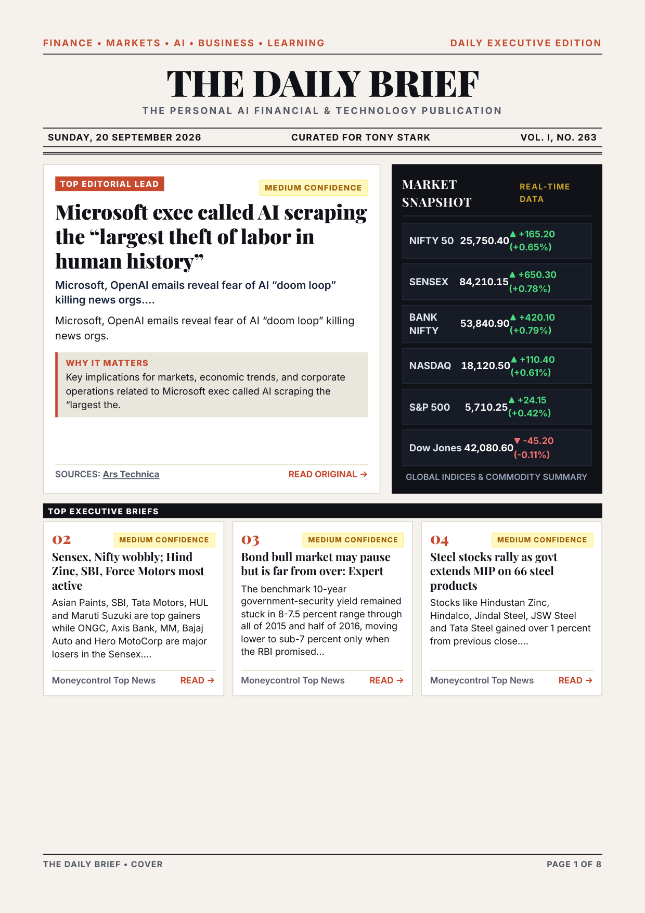
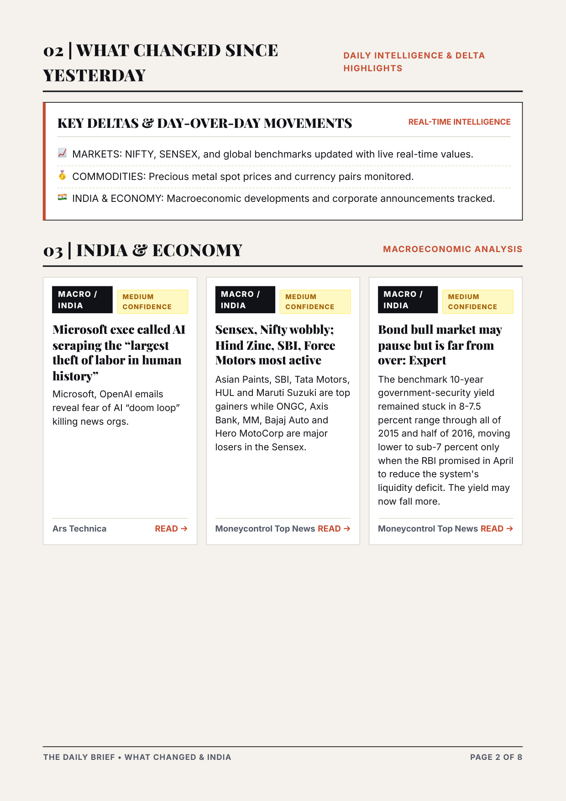
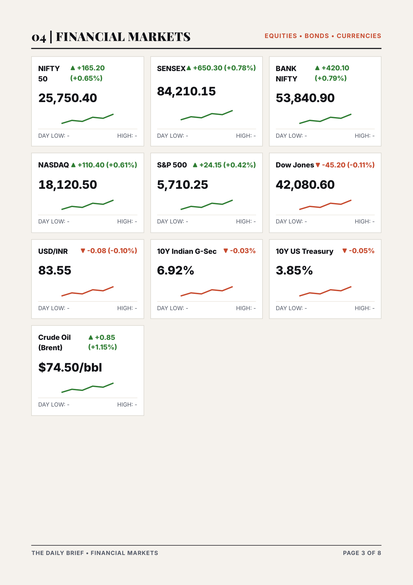
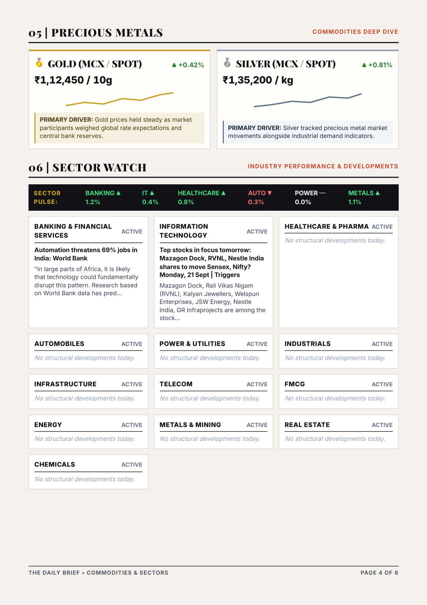
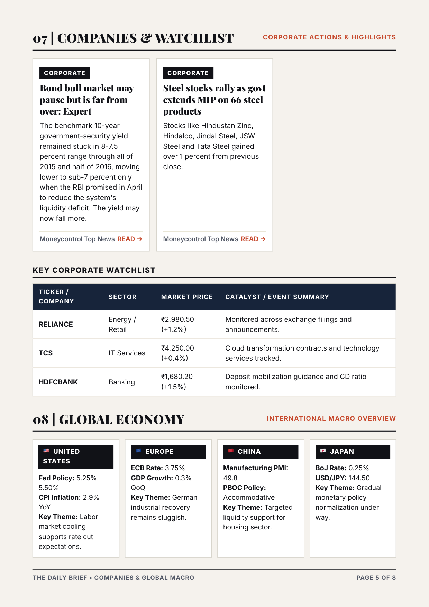
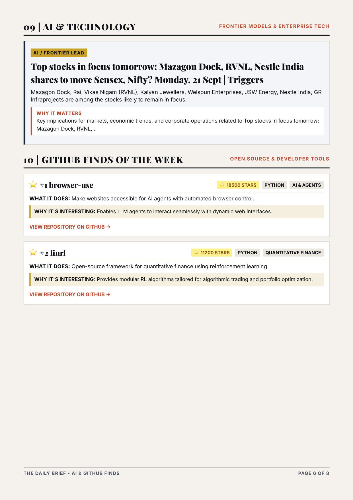
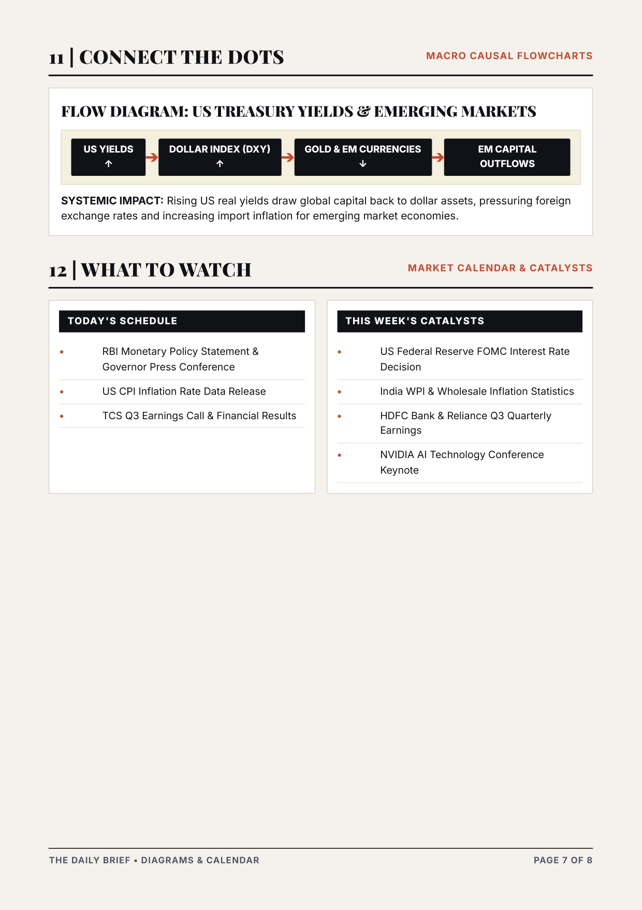
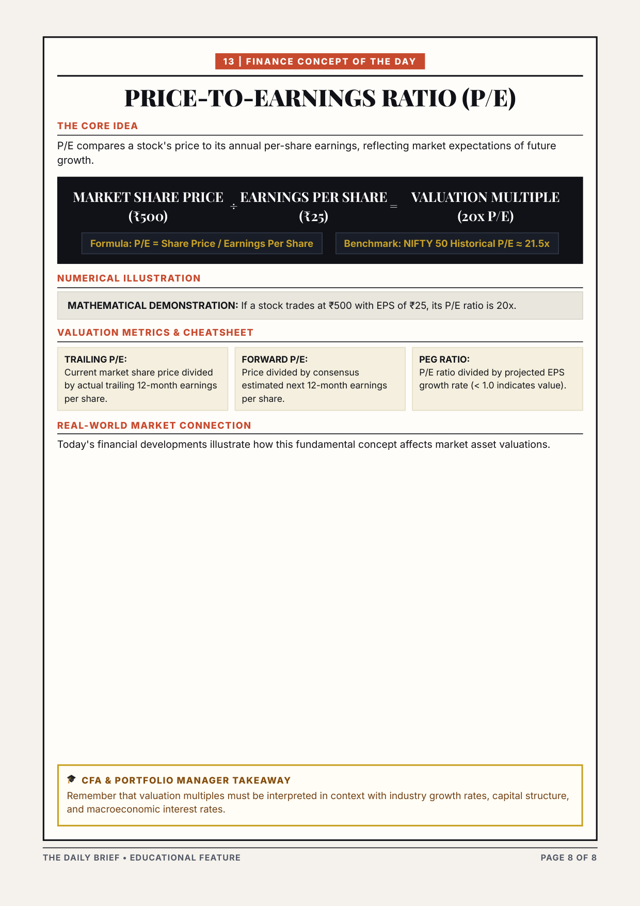

# Personal AI Daily Newspaper

An automated, AI-powered daily executive newspaper that ingests RSS news feeds, cleans and deduplicates articles, clusters event stories, ranks content based on personal interests and company watchlists, synthesizes executive briefs using LLM providers (Google Gemini / FreeLLMAPI / OpenAI compatible), generates a modern digital HTML & Playwright PDF newspaper edition, archives previous editions in SQLite, and delivers via Email/WhatsApp.

---

## 📰 Today's Edition — 20 September 2026 (Full Pages)

The generated PDF edition features an 8-page modern executive publication design:

### Page 1: Masthead, Lead Story & Top Briefs


---

### Page 2: What Changed Today & India Economy


---

### Page 3: Financial Markets & Sector Watch


---

### Page 4: Precious Metals (Gold & Silver) & Global Economy


---

### Page 5: Companies & Watchlist Intelligence


---

### Page 6: AI & Technology / Trending GitHub Repositories


---

### Page 7: Connect The Dots — Macro Causal Flows


---

### Page 8: Finance Concept of the Day & Educational Feature


---

## Key Features

- **Automated Collection**: RSS feed collection from business, technology, economy, and global finance feeds.
- **Multi-Level Deduplication**: URL hash checking, title similarity matching (RapidFuzz), and event story clustering.
- **Personalized Ranking**: Scoring based on global importance + personal relevance (company watchlist matches for Reliance, TCS, HDFC Bank, NVIDIA, Microsoft, Apple, etc.).
- **LLM Editorial Engine**: Supports Google Gemini API (`LLM_PROVIDER=gemini`) & OpenAI-compatible local providers (FreeLLMAPI / Ollama) generating crisp summaries, Why-It-Matters insights, Finance Concept of the Day, and macro causal connections.
- **Modern Digital Newspaper Design**: Jinja2 rendered HTML & Playwright Chromium PDF daily brief with serif headlines, dark/light theme accents, market ticker bar, and clickable original source links.
- **Delivery Adapters**: HTML Email delivery via SMTP and optional WhatsApp notifications.
- **Zero-Lock-in Architecture**: Easily configurable via `config.yaml` and `.env`.

---

## Directory Structure

```
Personalized-newspaper/
├── app/
│   ├── collectors/       # RSS and Web collectors
│   ├── processing/       # Cleaner, Deduplicator, Story Clusterer, Ranker
│   ├── llm/              # LLMProvider abstraction, GeminiProvider, FreeLLMAPIProvider, LLMEditor
│   ├── newspaper/        # Jinja2 Generator, newspaper.html template, style.css
│   ├── delivery/         # Email & WhatsApp delivery adapters
│   ├── database/         # SQLite models & DatabaseManager
│   ├── config.py         # Config loader
│   └── pipeline.py       # Orchestration pipeline
├── data/                 # SQLite database & HTML/PDF editions archive
├── docs/images/          # Rendered PDF page images for preview
├── tests/                # Automated Pytest suite
├── scripts/              # Automation cron runner
├── config.yaml           # User interests, watchlist, feeds & scoring weights
├── .env.example          # Environment variable template
├── main.py               # CLI entrypoint
└── requirements.txt      # Dependencies
```

---

## Quick Start

### 1. Setup Environment
```bash
python3 -m venv .venv
source .venv/bin/activate
pip install -r requirements.txt
```

### 2. Configure Credentials & Preferences
Copy `.env.example` to `.env` and fill in your options:
```bash
cp .env.example .env
```

For **Google Gemini Free API**:
```env
LLM_PROVIDER=gemini
LLM_BASE_URL=https://generativelanguage.googleapis.com/v1beta/openai
LLM_API_KEY=your_gemini_api_key
LLM_MODEL=gemini-1.5-flash
```

Edit `config.yaml` to customize your topic interests, watchlist companies, and RSS feeds.

### 3. Verify LLM Health Connection
```bash
python main.py --test-llm
```

### 4. Run Pipeline (Dry Run Mode)
Run the pipeline locally without sending emails:
```bash
python main.py --dry-run
```
The generated HTML newspaper will be saved to `data/editions/EDITION_YYYYMMDD.html` and PDF to `data/editions/EDITION_YYYYMMDD.pdf`.

---

## CLI Usage Flags

- `python main.py --dry-run` : Execute complete pipeline and generate HTML & PDF edition locally.
- `python main.py --test-llm` : Run diagnostic health check on LLM provider.
- `python main.py --collect` : Run RSS news collection only and store in SQLite.
- `python main.py --send` : Deliver the latest edition via configured Email/WhatsApp.
- `python main.py --test-email` : Verify SMTP email login credentials.

---

## Running Unit Tests

Run the full pytest suite:
```bash
pytest tests/ -v
```

---

## Daily Automation (macOS / Linux cron)

To run the pipeline every morning at 7:00 AM:
```bash
crontab -e
```
Add line:
```cron
0 7 * * * /path/to/Personalized-newspaper/scripts/daily_cron.sh
```
